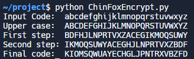
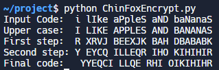
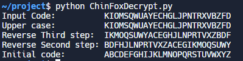
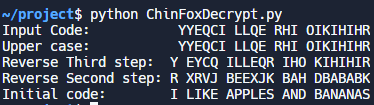
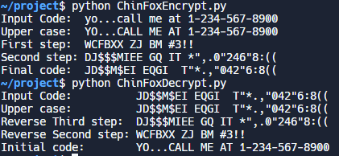
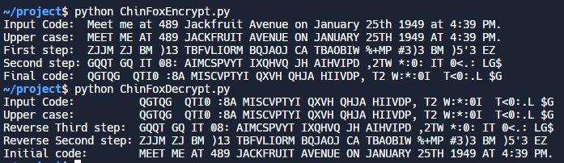
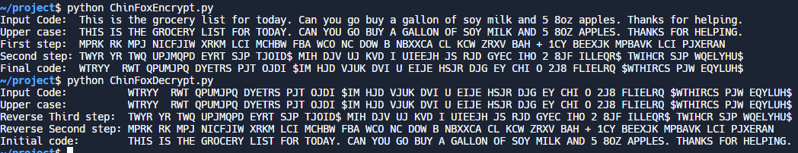

# Foxchin Cipher
#### (Works best with letters and digits)
###### Ryan Chin, Jonathan Fox

## Encryption:
###### Written by Ryan Chin
### Definition:
##### 1. Multiply every letter's position by 2 to give new letter. If final value is more than 26, we subtract 27.
##### 2. Shift every term by 7 letter spaces to the right.
##### 3. Switch every two terms.

### Example Output:

### Example Output With Spaces:

## Decryption:
###### Written by Jonathan Fox
### Definition:
##### 1. First uppercase all letters.
##### 2. Swap every two terms.
##### 3. Shift each term 7 letters to the left.
##### 4. Reverse the first step by dividing by two and if it was odd, add 27.

### Example Output: 

### Example Output with Spaces:

## Full Examples
### 1)

### 2)

### 3)

